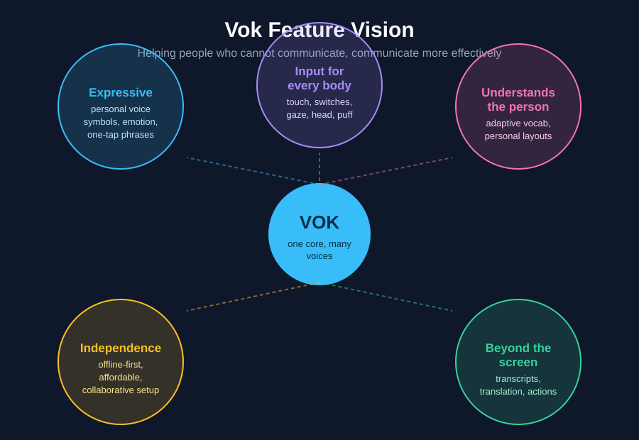
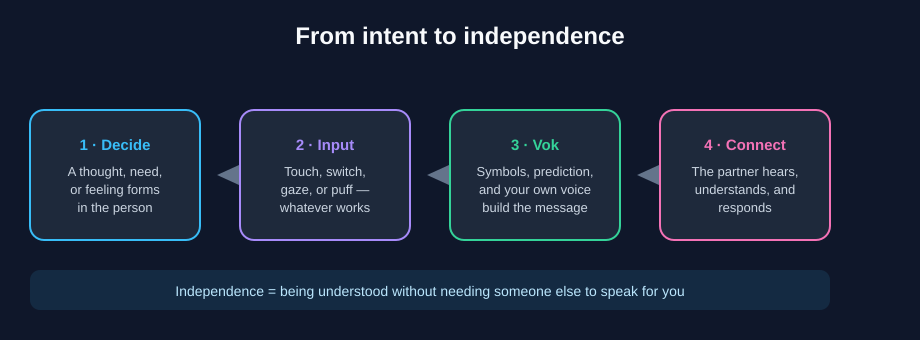

# Vok

**Helping people who cannot communicate, communicate more effectively.**

<p align="center">
  
  <br>
  <em>The Vok feature vision — one core, many voices.</em>
</p>

Vok is a Windows-focused AAC (augmentative and alternative communication)
application that helps people who cannot reliably speak get their thoughts
across quickly, naturally, and independently — built with .NET MAUI, Blazor,
and a service-oriented domain/infrastructure layer.

<p align="center">
  
  <em>From intent to independence.</em>
</p>

## What Vok aims to do

- Give people who cannot comfortably or reliably speak a **better way to be understood**.
- Adapt to **diverse input methods**: switch access, eye gaze, symbols, touch, or any assistive device.
- Make expressing thoughts **faster and less effortful** than longhand alternatives.
- Keep the **person's own intent and personality** front and center.

## How it helps

- **More independence** — say it yourself instead of relying on someone to interpret.
- **Faster connection** — express wants, needs, ideas, and feelings in the moment.
- **Less frustration** — fewer failed attempts to be understood.
- **Real relationships** — better communication means stronger connections with family, friends, carers, and clinicians.

## Feature vision

Vok is engineered to widen the mission as far as it can go:

- **Expressive communication** — your own banked/cloned voice, symbols, emotion markers, and one-tap sentences.
- **Input for every body** — touch, switches, eye gaze, head tracking, sip-and-puff.
- **Understanding the person** — adaptive vocabulary and layouts that become *their* voice.
- **Beyond the screen** — partner transcripts, translation, environmental actions, emergency phrases.
- **Independence at every step** — offline-first, affordable hardware, collaborative configuration.

See [Features](wiki/Features.md) for the full vision.

## MVP

Vok's MVP proves one thing: **a person who cannot reliably speak gets a real
thought out, on their own, in under a minute.** Scope, success criteria, and
rationale are on the [MVP page](wiki/MVP.md).

## Timeline (milestones)

The roadmap is tracked as GitHub Milestones on the Issues page and detailed on
the [Timeline & Milestones](wiki/Timeline-&-Milestones.md) wiki page:
**Listen → A First Voice → In Their Hands → Beyond the Screen → v1.0.**

## Issues & tasks

All bugs, features, and internal tasks are tracked via
[GitHub Issues](https://github.com/Divide-By-Zero-Solutions/Vok/issues) using the checked-in templates
([bug](.github/ISSUE_TEMPLATE/bug_report.md),
[feature](.github/ISSUE_TEMPLATE/feature_request.md),
[task](.github/ISSUE_TEMPLATE/task.md)).

## Wiki

- [Home](wiki/Home.md)
- [Features](wiki/Features.md)
- [MVP](wiki/MVP.md)
- [Timeline & Milestones](wiki/Timeline-&-Milestones.md)
- [Design & Diagrams](wiki/Design-&-Diagrams.md)

## Documentation

Start with the [documentation index](docs/README.md). It links the [architecture](docs/architecture.md), [data model and ERD](docs/data-model.md), [UML and Mermaid diagrams](docs/diagrams.md), [coding standards](docs/standards.md), [testing strategy](docs/testing.md), [API contracts](docs/api.md), [performance guide](docs/performance.md), and [deployment guide](docs/deployment.md). Each project also has a local README: [Domain](Vok.Domain/README.md), [Infrastructure](Vok.Infrastructure/README.md), [MAUI](Vok.Maui/README.md), [Tests](Vok.Tests/README.md), and [Performance](performance/README.md).

## Performance workflow

The dedicated `Vok.Performance` and `Vok.Performance.Integration` projects contain reproducible BenchmarkDotNet scenarios. Run the report generator manually with:

```powershell
pwsh ./scripts/Update-PerformanceReport.ps1
```

Install the local pre-commit hook with:

```powershell
pwsh ./scripts/Install-GitHooks.ps1
```

The hook updates and stages the generated report before each commit. Set `SKIP_PERFORMANCE_REPORT=1` for an intentional opt-out. Benchmark results are machine-specific and should be used for regression tracking.

The installer configures `core.hooksPath` to `.githooks`; run it from the repository root after `git init` or after cloning. GitHub Actions builds and tests every push and pull request. Benchmark execution is available through a manually dispatched workflow run with the `run_performance` input enabled.

## Performance targets

The manual performance workflow enforces these regression ceilings on the GitHub-hosted Windows runner. Targets are intentionally conservative and should be compared only across the same runner class:

| Area | Benchmark | Time ceiling | Allocation ceiling |
| --- | --- | ---: | ---: |
| Prediction cache | `CachePrediction` | 1,000 ns | 512 B |
| Phrase normalization | `NormalizePhrase` | 1,000 ns | 512 B |
| SQLite vocabulary read | `ReadVocabularyTiles` | 100,000 ns | 4 KB |
| SQLite vocabulary write | `AddVocabularyTile` | 250 ms | 20 MB |

## Performance improvement plan

1. **Prediction and text paths:** replace repeated string allocations with a normalized-key strategy using `StringComparer.OrdinalIgnoreCase`, and benchmark cache hit, miss, clear, and multi-entry workloads.
2. **SQLite reads:** add category-size scenarios, avoid rebuilding all cached categories after every operation, and measure indexed queries at 10, 100, and 1,000 tiles.
3. **SQLite writes:** batch category/tile changes in transactions, reduce full-cache reloads, and separate one-time database initialization from steady-state writes.
4. **AI and voice orchestration:** add latency benchmarks around local fallback, request cancellation, and prediction aggregation using deterministic fakes; keep network providers out of CI benchmarks.
5. **UI responsiveness:** measure page-load data preparation and sentence-building operations, then move expensive work off the UI thread and cap unnecessary render/state updates.
6. **Regression control:** review benchmark trends per change, lower ceilings only after measured improvements, and investigate any allocation or latency regression before updating targets.

<!-- PERFORMANCE-REPORT:START -->
## Performance report

> Generated from the dedicated `Vok.Performance` BenchmarkDotNet project. Results are machine-specific and intended for regression tracking, not cross-machine comparison.

OS: Microsoft Windows NT 10.0.26200.0; Runtime: .NET 10.0.12; Generated: 2026-09-23 01:58:17 UTC

### Vok.Performance.PortableBenchmarks

```

BenchmarkDotNet v0.14.0, Windows 11 (10.0.26200.9457)
Unknown processor
.NET SDK 10.0.401
  [Host]     : .NET 10.0.12 (10.0.1226.42308), X64 RyuJIT AVX-512F+CD+BW+DQ+VL+VBMI
  Job-ASNSOY : .NET 10.0.12 (10.0.1226.42308), X64 RyuJIT AVX-512F+CD+BW+DQ+VL+VBMI

IterationCount=3  LaunchCount=1  WarmupCount=1  

```
| Method          | Mean      | Error    | StdDev    | Gen0   | Allocated |
|---------------- |----------:|---------:|----------:|-------:|----------:|
| CachePrediction | 11.562 ns | 1.885 ns | 0.1033 ns | 0.0048 |      80 B |
| NormalizePhrase |  9.159 ns | 2.019 ns | 0.1107 ns | 0.0033 |      56 B |

### Vok.Performance.Integration.SqliteVocabularyBenchmarks

```

BenchmarkDotNet v0.14.0, Windows 11 (10.0.26200.9457)
Unknown processor
.NET SDK 10.0.401
  [Host] : .NET 10.0.12 (10.0.1226.42308), X64 RyuJIT AVX-512F+CD+BW+DQ+VL+VBMI


```
| Method              | Job        | Toolchain              | IterationCount | LaunchCount | WarmupCount | Mean              | Error           | StdDev            | Gen0    | Gen1    | Gen2    | Allocated |
|-------------------- |----------- |----------------------- |--------------- |------------ |------------ |------------------:|----------------:|------------------:|--------:|--------:|--------:|----------:|
| AddVocabularyTile   | Job-NQUHSU | Default                | 3              | 1           | 1           |                NA |              NA |                NA |      NA |      NA |      NA |        NA |
| ReadVocabularyTiles | Job-NQUHSU | Default                | 3              | 1           | 1           |                NA |              NA |                NA |      NA |      NA |      NA |        NA |
| AddVocabularyTile   | InProcess  | InProcessEmitToolchain | Default        | Default     | Default     | 12,711,468.828 ns | 875,312.4377 ns | 2,580,878.6590 ns | 78.1250 | 78.1250 | 70.3125 | 7195149 B |
| ReadVocabularyTiles | InProcess  | InProcessEmitToolchain | Default        | Default     | Default     |          7.897 ns |       0.0949 ns |         0.0888 ns |  0.0033 |       - |       - |      56 B |

Benchmarks with issues:
  SqliteVocabularyBenchmarks.AddVocabularyTile: Job-NQUHSU(IterationCount=3, LaunchCount=1, WarmupCount=1)
  SqliteVocabularyBenchmarks.ReadVocabularyTiles: Job-NQUHSU(IterationCount=3, LaunchCount=1, WarmupCount=1)
<!-- PERFORMANCE-REPORT:END -->


