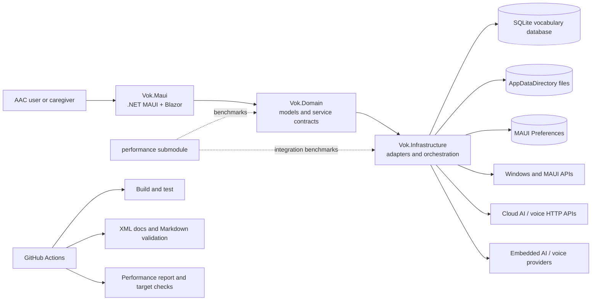

# System architecture

Vok is a Windows-focused .NET MAUI application with a Blazor UI, a domain contract layer, infrastructure adapters, and an independently versioned performance submodule.

## Dependency direction

`Vok.Maui` composes the application and depends on `Vok.Domain` contracts. `Vok.Infrastructure` implements those contracts and may depend on platform or provider libraries. `Vok.Domain` must not depend on MAUI, SQLite, HTTP clients, or provider SDKs. The performance submodule consumes domain/infrastructure behavior but is not a runtime dependency of the application.

## Runtime composition

`MauiProgram` registers concrete infrastructure services with the MAUI dependency injection container. Pages request interfaces through constructor or property injection and coordinate user interactions. Orchestrators provide fallback and sequencing behavior where multiple providers are available.
