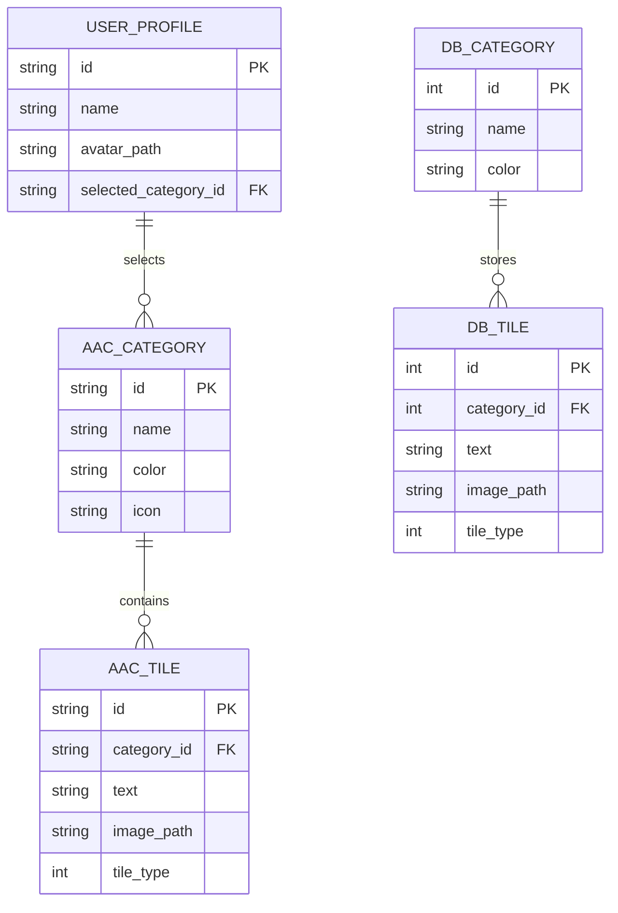

# Data model and persistence

The application uses domain models for vocabulary and profiles, SQLite for structured vocabulary persistence, JSON files for selected settings/profiles/backups, and MAUI Preferences for lightweight serialized state.

## Persistence responsibilities

- `SqliteVocabularyService` owns SQLite schema creation, category/tile mapping, reads, and writes.
- `LocalVocabularyService` provides lightweight serialized vocabulary state through MAUI Preferences.
- `LocalProfileService` persists profile data under the application data directory.
- `AppConfig`, `AiSettings`, and voice settings persist configuration and provider choices.
- `BackupService` serializes category and tile collections for caregiver export/import.

The database and application data paths are runtime-specific. Tests and benchmarks must use temporary isolated paths and must not depend on production user data.
