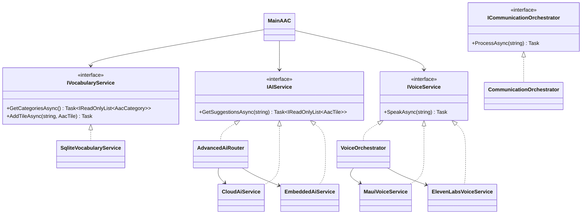
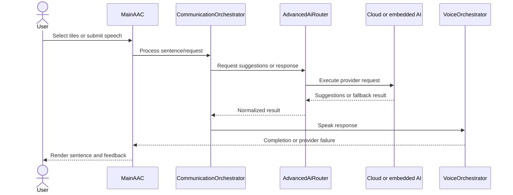
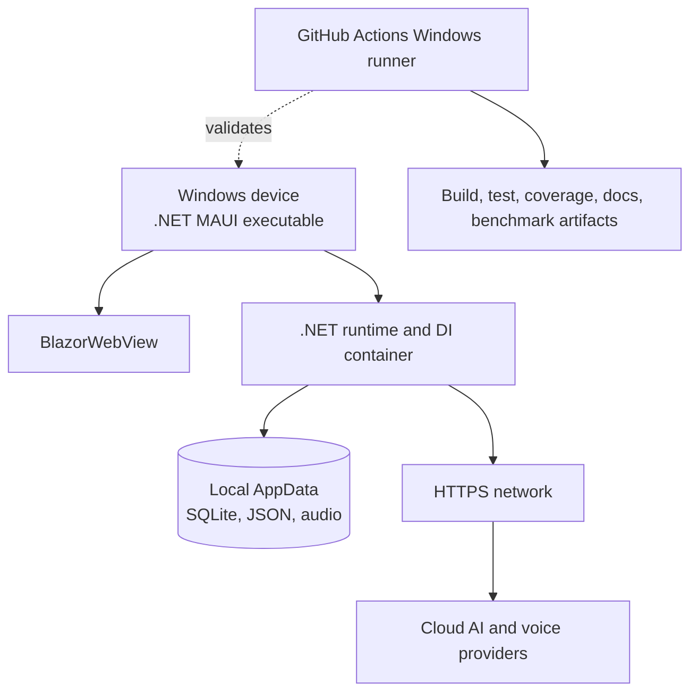
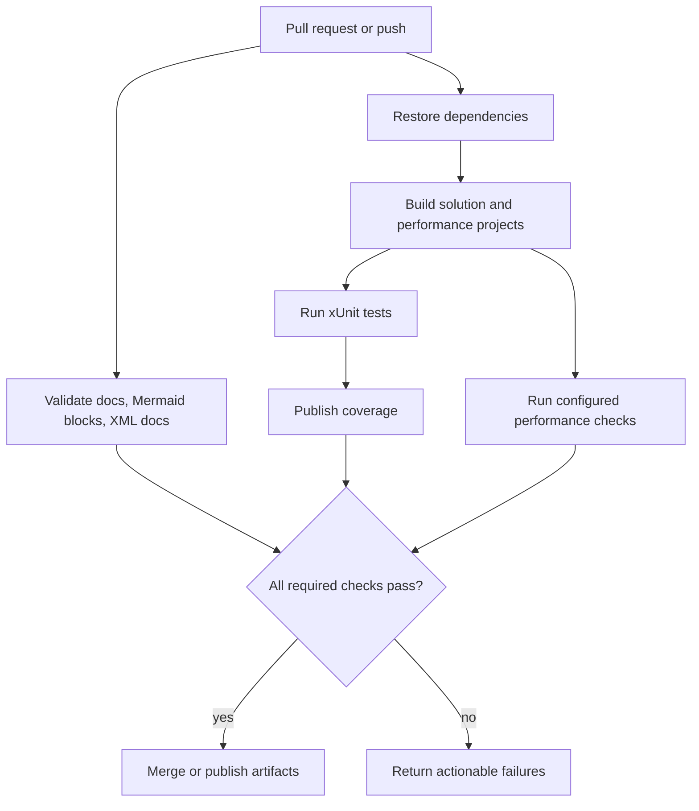

# UML, sequence, deployment, and test diagrams

## Service UML

```mermaid
classDiagram
	class IAIService {
		<<interface>>
		+GetSuggestionsAsync(string) Task~IReadOnlyList~AacTile~~
	}
	class IVoiceService {
		<<interface>>
		+SpeakAsync(string) Task
	}
	class IVocabularyService {
		<<interface>>
		+GetCategoriesAsync() Task~IReadOnlyList~AacCategory~~
		+AddTileAsync(string, AacTile) Task
	}
	class ICommunicationOrchestrator {
		<<interface>>
		+ProcessAsync(string) Task
	}
	class AdvancedAiRouter
	class VoiceOrchestrator
	class SqliteVocabularyService
	class CloudAiService
	class EmbeddedAiService
	class MauiVoiceService
	class ElevenLabsVoiceService
	class MainAAC
	IAIService <|.. AdvancedAiRouter
	IAIService <|.. CloudAiService
	IAIService <|.. EmbeddedAiService
	IVoiceService <|.. VoiceOrchestrator
	IVoiceService <|.. MauiVoiceService
	IVoiceService <|.. ElevenLabsVoiceService
	IVocabularyService <|.. SqliteVocabularyService
	MainAAC --> IVocabularyService
	MainAAC --> IAIService
	MainAAC --> IVoiceService
	AdvancedAiRouter --> CloudAiService
	AdvancedAiRouter --> EmbeddedAiService
	VoiceOrchestrator --> MauiVoiceService
	VoiceOrchestrator --> ElevenLabsVoiceService
	ICommunicationOrchestrator <|.. CommunicationOrchestrator
```

## Communication sequence

```mermaid
sequenceDiagram
	actor User
	participant UI as MainAAC
	participant Orchestrator as CommunicationOrchestrator
	participant AI as AdvancedAiRouter
	participant Provider as Cloud or embedded AI
	participant Voice as VoiceOrchestrator

	User->>UI: Select tiles or submit speech
	UI->>Orchestrator: Process sentence/request
	Orchestrator->>AI: Request suggestions or response
	AI->>Provider: Execute provider request
	Provider-->>AI: Suggestions or fallback result
	AI-->>Orchestrator: Normalized result
	Orchestrator->>Voice: Speak response
	Voice-->>UI: Completion or provider failure
	UI-->>User: Render sentence and feedback
```

## Deployment topology

```mermaid
graph TB
	Client[Windows device\n.NET MAUI executable]
	WebView[BlazorWebView]
	Runtime[.NET runtime and DI container]
	Data[(Local AppData\nSQLite, JSON, audio)]
	Internet[HTTPS network]
	AI[Cloud AI and voice providers]
	CI[GitHub Actions Windows runner]
	Artifact[Build, test, coverage, docs, benchmark artifacts]
	Client --> WebView
	Client --> Runtime
	Runtime --> Data
	Runtime --> Internet
	Internet --> AI
	CI --> Artifact
	CI -. validates .-> Client
```

## Test and documentation flow

```mermaid
flowchart TD
	Change[Pull request or push] --> Docs[Validate docs, Mermaid blocks, XML docs]
	Change --> Restore[Restore dependencies]
	Restore --> Build[Build solution and performance projects]
	Build --> Unit[Run xUnit tests]
	Unit --> Coverage[Publish coverage]
	Build --> Perf[Run configured performance checks]
	Docs --> Gate{All required checks pass?}
	Coverage --> Gate
	Perf --> Gate
	Gate -->|yes| Merge[Merge or publish artifacts]
	Gate -->|no| Fix[Return actionable failures]
```
