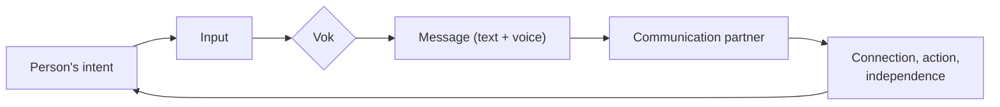
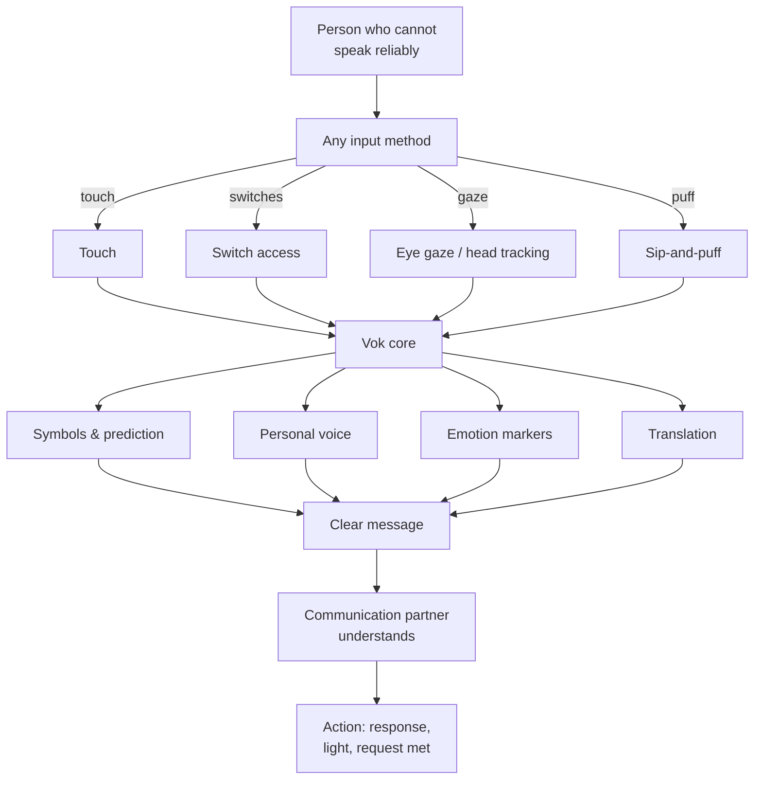
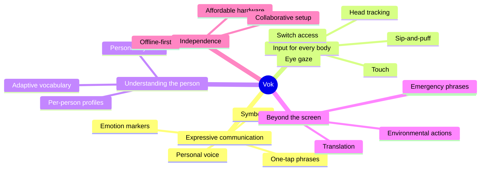
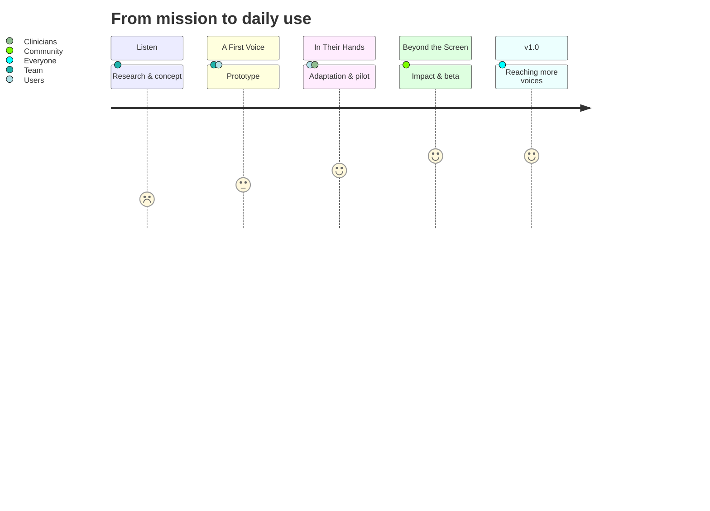
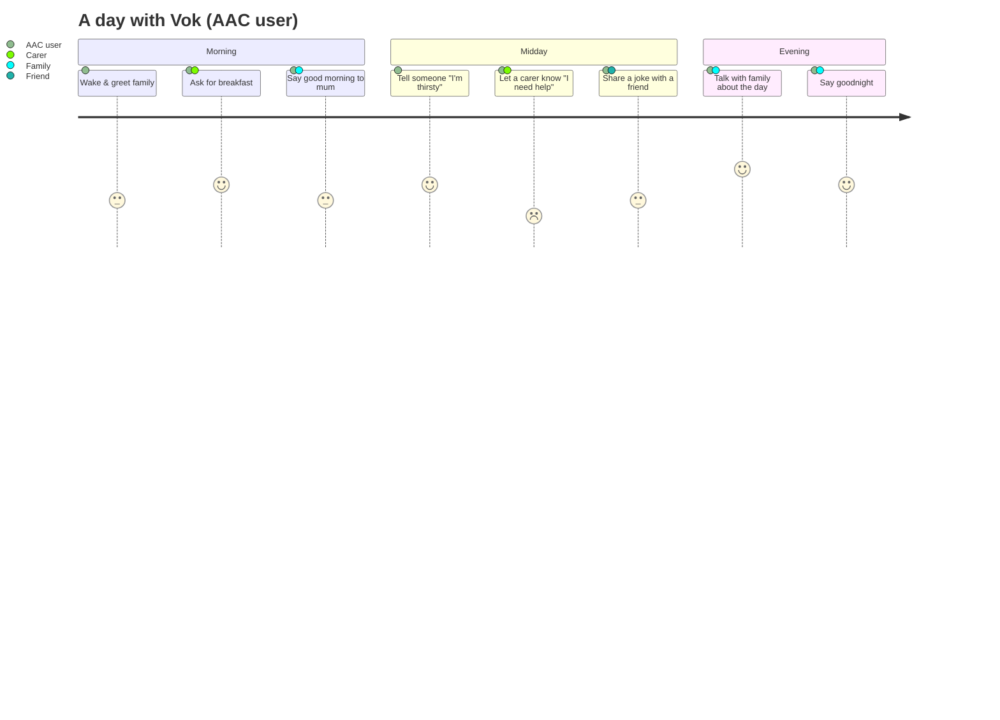
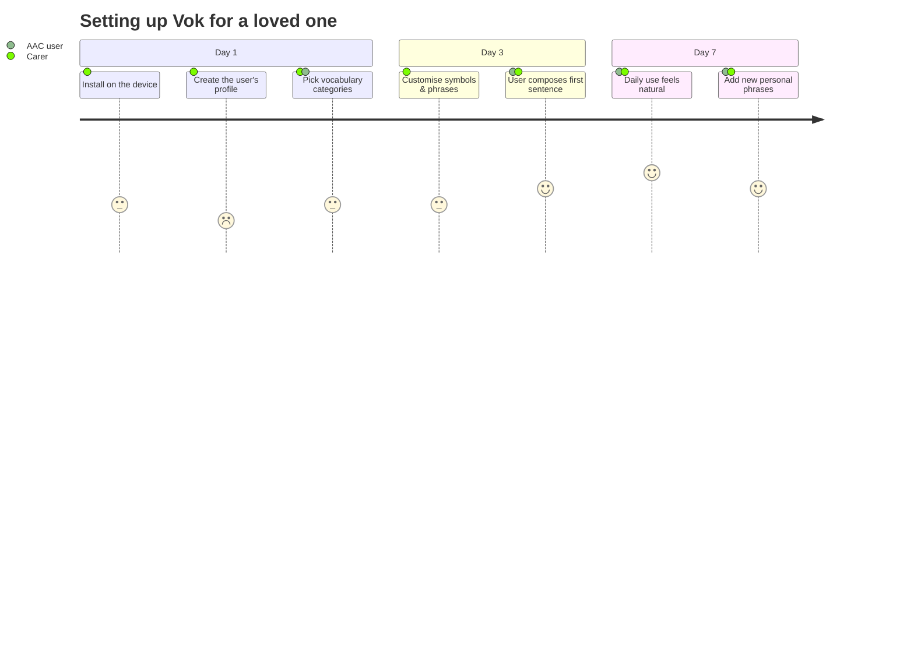
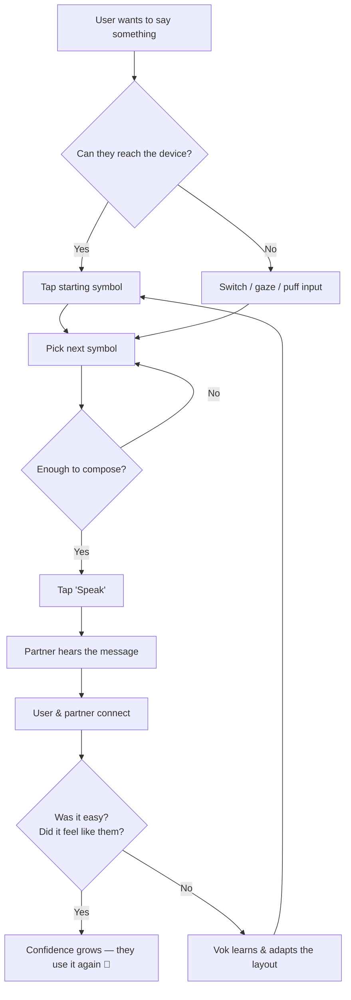
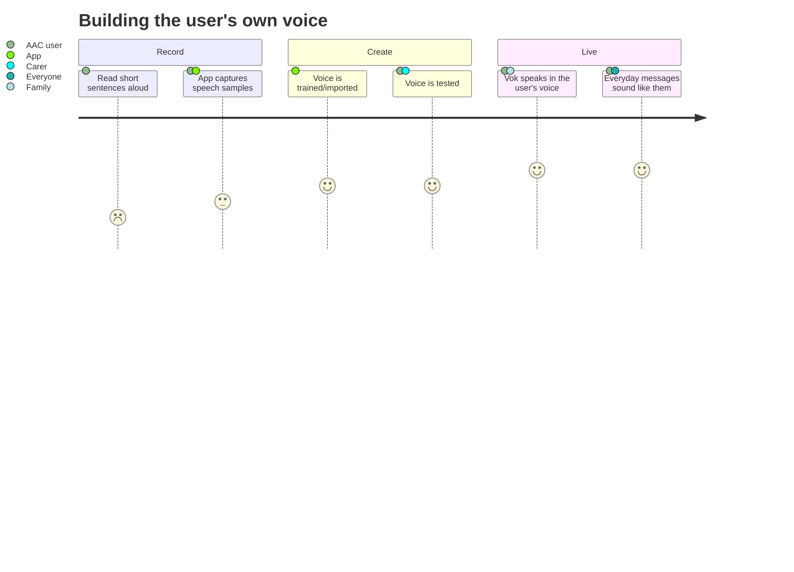
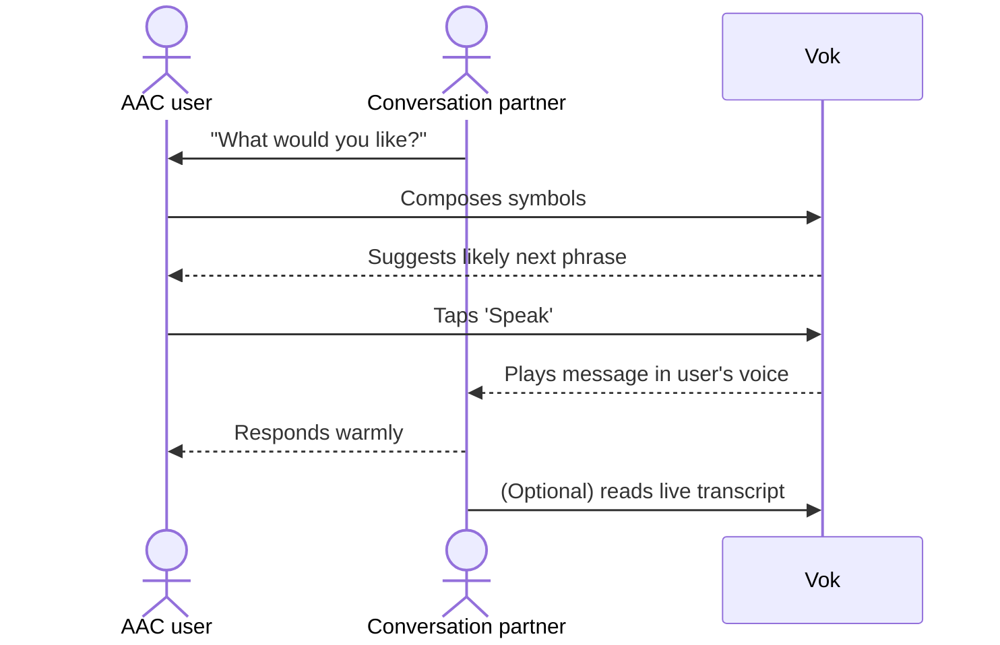

# Vok — Design & Diagrams

Visuals that illustrate how Vok turns a person's intent into real communication.

## The core loop

## From person to connection

## Feature vision map

## Milestone journey

## User journeys

### The AAC user's daily loop

### First-week onboarding (family / carer)

### First message ever

### Voice banking journey

### The conversation partner's flow

