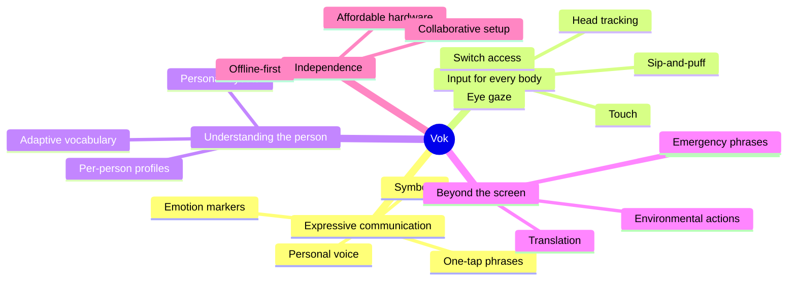
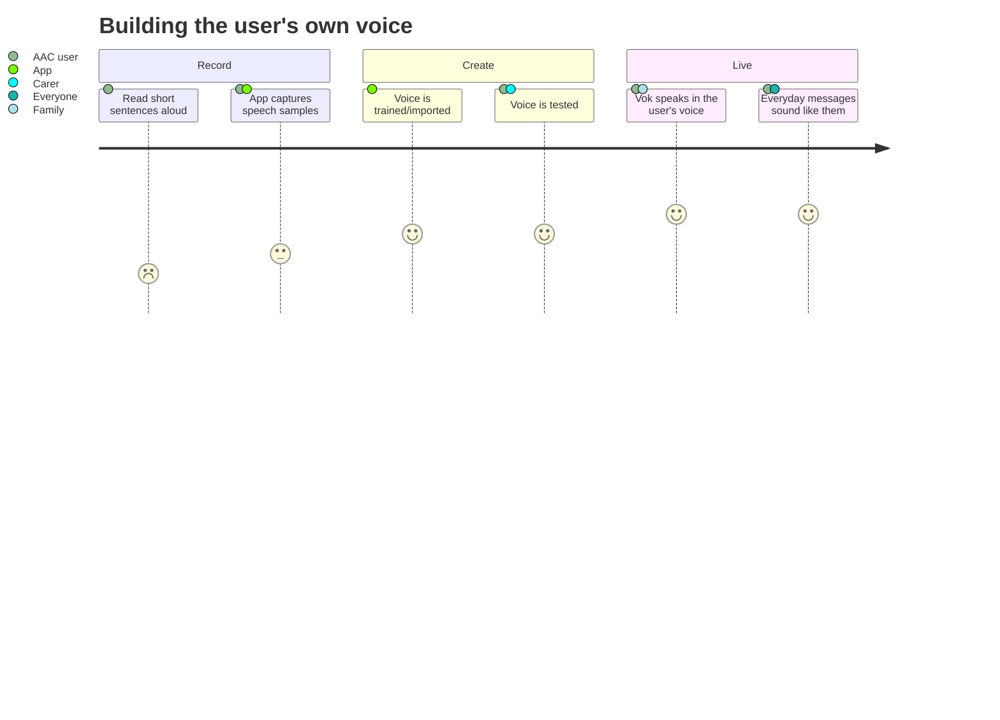
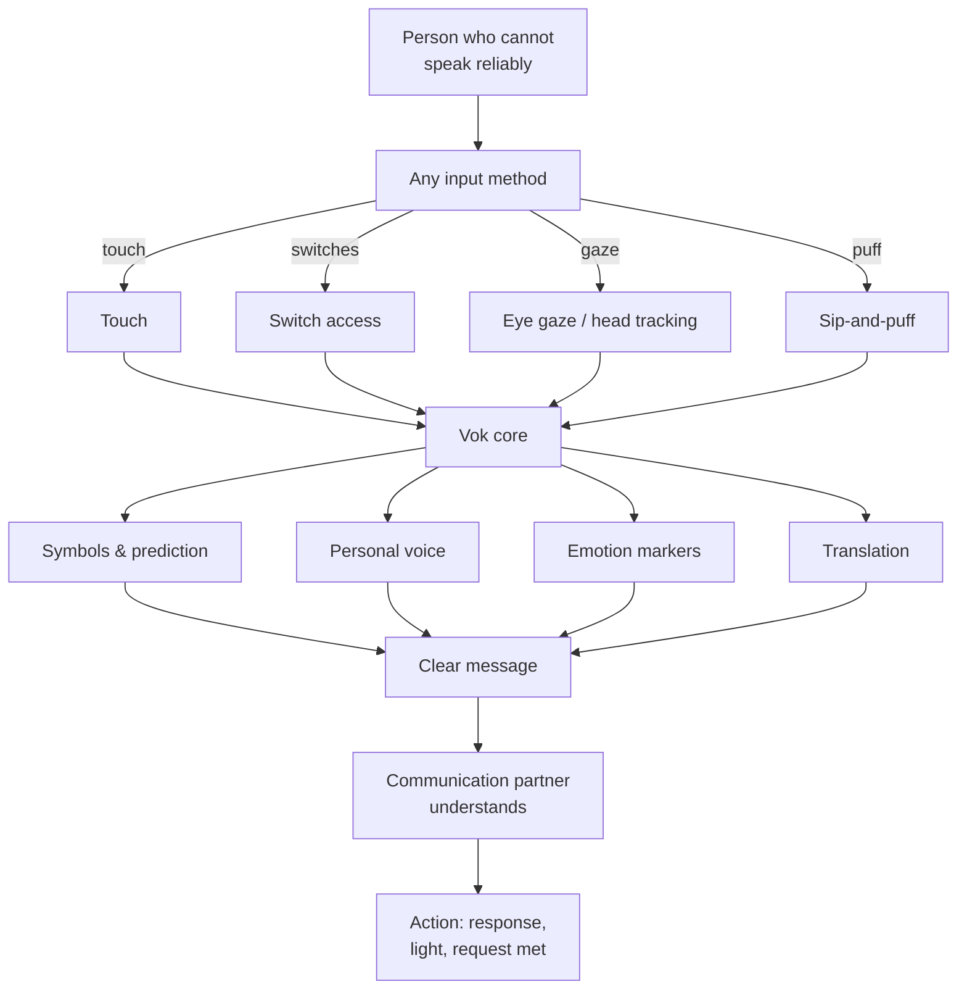
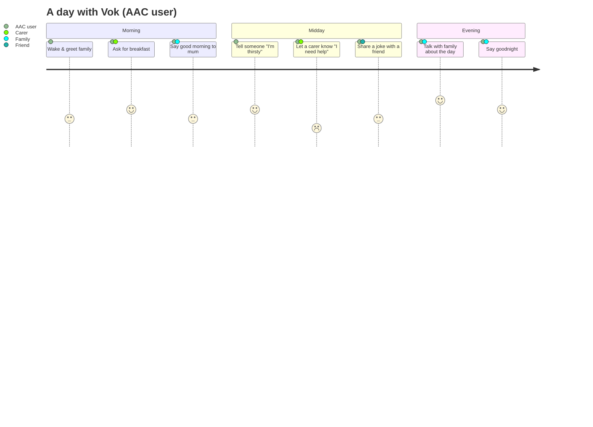
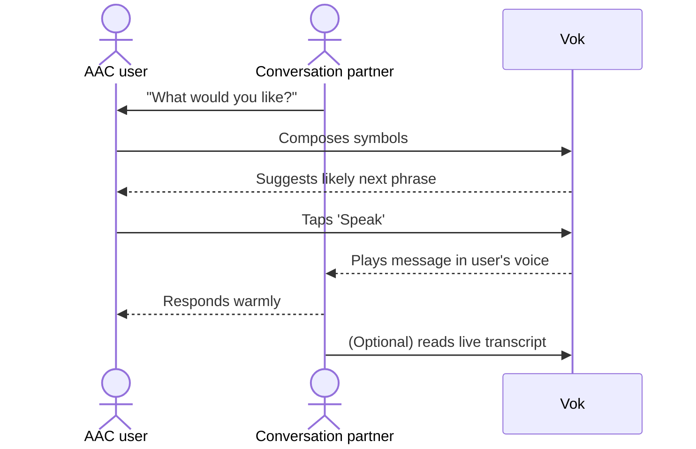
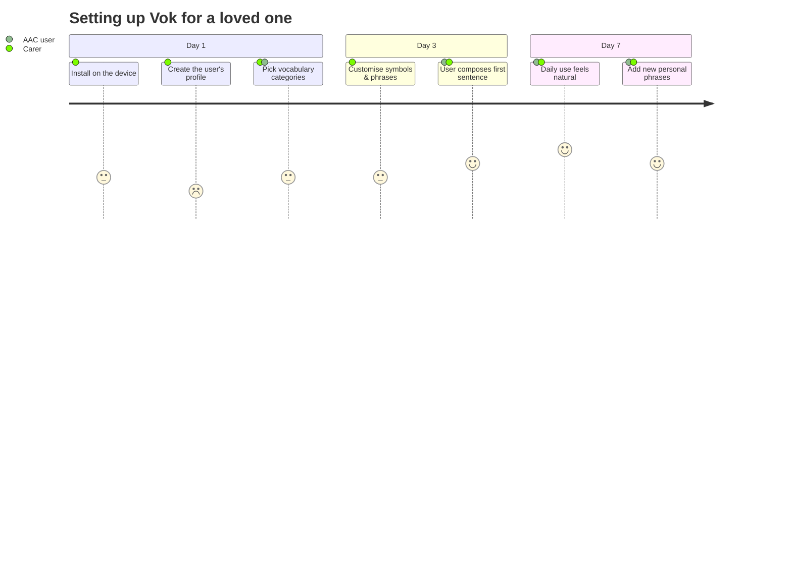

# Vok — Feature Vision

The mission: **helping people who cannot communicate, communicate more
effectively.** Every feature below exists to widen that mission — to reach more
people, remove more barriers, and hand more of a person's own voice back to them.

## Expressive communication

- **Symbol-first interface** — communicate with pictures before words.
- **Text-to-speech with your own voice** — voice banking and voice cloning so the
  tool sounds like *you*, not a machine.
- **Predicted phrases & smart completion** — say a whole sentence with one or two
  taps.
- **Emotion & tone markers** — express not just *what* you mean but *how* you feel:
  proud, joking, urgent, calm.
- **Storytelling & free expression** — build longer messages for conversations,
  not just needs.

### Voice banking journey

## Input for every body

- **Touch** and simple gestures.
- **Switch access** — one or two switches for limited motor control.
- **Eye gaze** and **head tracking** for people who cannot reach a screen.
- **Joystick / sip-and-puff** and other assistive switches.
- **Mapping to existing devices** — work with the assistive hardware people are
  already using, instead of forcing new equipment.

## Understanding the person

- **Personal vocabulary** — words, names, and phrases unique to each user.
- **Adaptive learning** — the tool learns which words and phrases each person
  reaches for and brings them closer.
- **Profile per person** — no shared generic boards; the layout is *their* layout.

### A day with Vok

## Beyond the screen

- **Real-time transcript for conversation partners** — the people you're talking
  to see and hear clearly.
- **Translation** — a person's message, understood in other languages.
- **Environmental actions** — from "I'm thirsty" to turning on a light: go from
  expression to action.
- **Emergency & health phrases** — always-available critical messages.

### The conversation partner's flow

## Independence at every step

- Works offline for privacy and reliability.
- Runs on affordable, accessible hardware, not only premium devices.
- Settings that a family, carer, or clinician can configure collaboratively —
  without code.

### Setting up Vok for a loved one

## The bigger mission

Vok is not a single app. It is the foundation for a person's independence and
dignity — and a bridge between them and everyone who loves them.