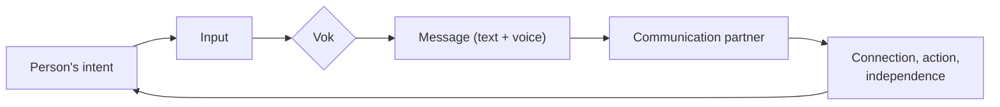

# Vok

**Helping people who cannot communicate, communicate more effectively.**

## Mission

Vok exists for one reason: everyone deserves to be understood. For people who
cannot reliably speak — whether due to a speech disorder, motor impairment,
neurological condition, stroke, or any other reason — communication can become
slow, exhausting, or dependent on others. Vok removes those barriers.

## The problem

When speech is hard or impossible, people are often left with tools that are:

- **Slow** — several keystrokes or eye movements per word.
- **Generic** — one layout for everyone, ignoring individual needs.
- **Impersonal** — the person's own voice, humor, and intent get lost.

The result is the same for every person: **isolation**. Needs go unmet.
Feelings stay locked inside. Moments are missed.

## What Vok does

Vok is an **assistive-communication tool** that helps people get their
thoughts across quickly and naturally — using the input methods that already
work for them.

- **Multiple input paths** — symbols, touch, head/eye tracking, switches, and sip-and-puff.
- **Smart prediction** — fewer steps to say what you mean.
- **Personal voice** — your own banked or cloned voice, emotion markers, and one-tap phrases.
- **Beyond the screen** — partner transcripts, translation, and environmental actions.
- **Designed with users** — built alongside the people who need it and the professionals who support them.

### The core loop

A person has something to say, uses the input that already works for them,
Vok turns it into a clear message, someone hears and responds — and that moment
of connection drives the next one.

See the [full feature vision](https://github.com/Divide-By-Zero-Solutions/Vok/wiki/Features).

## MVP first

Before any of that vision, Vok starts with a Minimum Viable Product that proves
the core promise: **a person who cannot reliably speak gets a real thought out,
on their own, in under a minute.** Scope and criteria live on the
[MVP page](https://github.com/Divide-By-Zero-Solutions/Vok/wiki/MVP).

## How it helps

- **More independence** — say it yourself instead of relying on someone to interpret.
- **Faster connection** — express wants, needs, ideas, and feelings in the moment.
- **Less frustration** — fewer failed attempts to be understood.
- **Real relationships** — better communication means stronger connections with family, friends, carers, and clinicians.

## A note on purpose

Vok does **not** replace a person's voice — it amplifies it. The technology
stays in the background, the person stays in front.

## Project status

Currently in **Phase 1 (research & core concept)**. See
[Timeline & Milestones](https://github.com/Divide-By-Zero-Solutions/Vok/wiki/Timeline-&-Milestones)
for the roadmap, and [Issues](https://github.com/Divide-By-Zero-Solutions/Vok/issues)
for active work.

## Getting involved

We want users, families, speech and language therapists, occupational
therapists, and accessibility specialists at the table. Every voice shapes Vok.