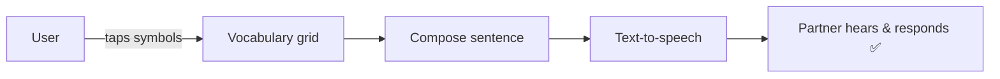
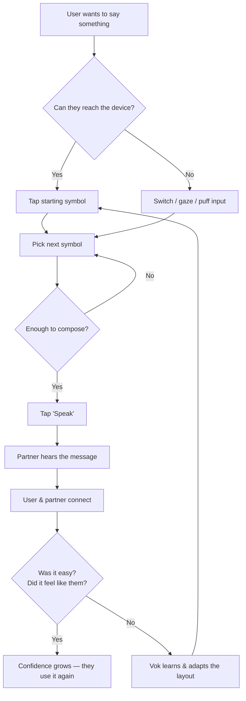

# Vok — MVP (Minimum Viable Product)

The MVP answers one question:

> **Can a person who cannot reliably speak get a real thought out,
> on their own, in under a minute?**

If yes — the mission is alive. Everything else is iterative polish.

## MVP scope

### In scope

- **One input path that works for someone** — symbol/touch-first grid (the
  lowest barrier, works for the widest range of motor abilities).
- **One output path** — clear text-to-speech of the composed message.
- **Core vocabulary** — a thoughtful starter set of needs, feelings, people,
  and everyday phrases.
- **Message building** — tap symbols → compose a sentence → speak it.
- **Offline-first** — no server required for daily use.
- **Works on an affordable device** — one mainstream tablet/phone class.

### Out of scope (post-MVP)

- Eye gaze, sip-and-puff, and advanced switch setups.
- Voice banking/cloning (personal voice).
- Translation and partner transcripts.
- Environmental actions (turning on lights, etc.).
- Adaptive learning / AI prediction.

These are deliberately deferred. They matter — they'll come fast — but they are
not required to prove the core promise.

## MVP success criteria

| Criterion | Target |
| --------- | ------ |
| A first-time user composes a message | Without help |
| Time to first message | < 60 seconds |
| New user onboards | < 5 minutes of setup |
| Works offline | 100% of core flow |
| Works on low-end hardware | No flagship devices required |

## The MVP diagram

## First message ever

## What we are NOT building yet (on purpose)

- No account/login required to start.
- No cloud dependency for basic use.
- No AI features blocking the core path.
- No support for exotic input until the fundamental loop is proven.

## Why MVP first

Communication tools fail when they chase every feature before the core loop
works. The MVP proves **independence in the moment** — the single most
important outcome — and builds trust with the community before we widen scope.