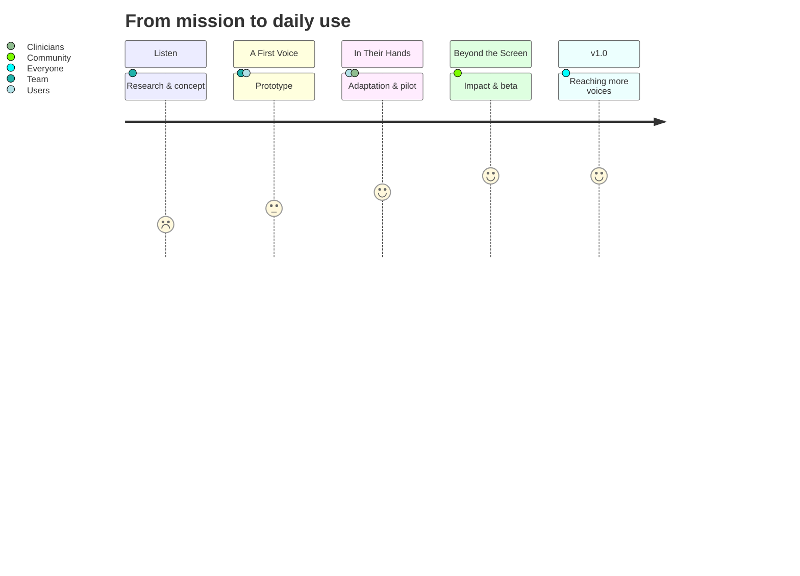

# Vok — Timeline & Milestones

This page maps the Vok roadmap into GitHub Milestones so the community can follow
what is coming and when to expect it. It builds toward the
[full feature vision](https://github.com/Divide-By-Zero-Solutions/Vok/wiki/Features).

## Milestone 1 — Listen (Research & Core Concept)

- Speak with potential users, families, and clinicians.
- Define the core communication problem and design principles.
- Decide the first supported input methods.
- **Goal:** understand exactly who Vok serves and what "more effective" means for them.
- *Acceptance:* validated problem statement and a documented core concept.

## Milestone 2 — A First Voice (Prototype)

- Working communication workflow end-to-end.
- Fast, low-effort message-building on at least one input path.
- First steps of the expressive feature set (prediction, personal voice).
- **Goal:** a real person can express a real thought.
- *Acceptance:* usability session with a user who gets a message out independently.

## Milestone 3 — In Their Hands (Adaptation)

- Expand input methods: symbols, switch, eye gaze, touch, sip-and-puff.
- Personalization of vocabulary, layout, and voice.
- Pilot testing with a small group.
- **Goal:** the tool fits the person, not the other way around.
- *Acceptance:* pilot users communicate faster/with less assistance than before.

## Milestone 4 — Beyond the Screen (Impact)

- Partner transcripts and translation.
- Environmental actions from expressed intent.
- Public beta open to users, families, and professionals.
- **Goal:** communication turns into connection and action.
- *Acceptance:* beta users report independence gains beyond message exchange.

## Milestone 5 — Reaching More Voices (v1.0)

- Full expressive + input + accessibility surface stabilized.
- Documentation and support channels for families, carers, and clinicians.
- **Goal:** a dependable tool people can rely on every day.
- *Acceptance:* v1.0 released and adopted beyond the pilot group.

## Converting to GitHub Milestones

Each row above maps 1:1 to a Milestone on
[the Issues page](https://github.com/Divide-By-Zero-Solutions/Vok/issues).
Tasks and feature requests reference their Milestone so the board always
reflects current status against the timeline.